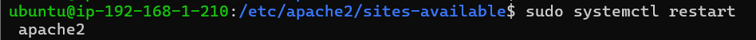

# lamp_tres_niveles
### Balanceador de carga con infraestructura LAMP en tres niveles.

# Índice
1. [Introducción](#introducción)
2. [Infraestructura](#infraestructura)
   * [Infraestructura de red](#infraestructura-de-red)
3. [Balanceador](#configuración-del-balanceador)
4. [Resultado](#resultado)
5. [Apache-Sever1](#configuración-del-servidor-de-apache-1)
6. [MYSQL](#configuración-del-servidor-de-base-de-datos-mysql)

# Introducción

En este proyecto se realiza la infraestructura de una pila LAMP en tres niveles sobre máquinas virtuales en AWS.

En un primer nivel, tendremos el balanceador de carga. En el segundo nivel, tendremos dos servidores web en Backend. En el tercer nivel, tendremos el servidor de bases de datos.

# Infraestructura

En este proyecto se explicarán detalladamente los pasos a seguir para la creación de la infraestructura necesaria.

## Infraestructura de red

#### VPC

En primer lugar, creamos una VPC. Vamos al menú de servicios de AWS, elegimos VPC y pulsamos sobre el botón de Crear VPC.

En este menú, tenemos dos opciones: Solo la VPC y la opción VPC y más. La diferencia entre ellas es que con la primera solo creamos la VPC, y con la segunda podemos crear las subredes, las tablas de enrutamiento y las puertas de enlace desde el mismo menú.

Primero, creamos nuestras VPC donde vamos a alojar nuestras dos subredes: la subred 1 donde estará el balanceador junto a nuestros servidores apache y en la segunda subred donde se almacenará el servidor MySQL.

Creamos las instancias. Las instancias que he usado son Debian.

A continuación, vamos a asociar una IP estática al balanceador para poder conectarnos y tener acceso a Internet.

Conectamos la gateway antes creada a Internet.

Luego nos vamos a asociar una dirección IP elástica para tener acceso a Internet desde el balanceador.

Se me olvidaba decir que tenemos que poner una puerta de enlace a Internet para poder tener Internet en las otras máquinas mientras las configuramos y descargamos los archivos necesarios.

# Configuración del balanceador

Copiamos el contenido del archivo default por si liamos y le ponemos un nombre para saber cuál es.

A continuación, dentro del balanceador copiamos lo siguiente.

Luego de copiar lo anterior, habilitamos el sitio web con `a2ensite`.

Nos vamos a nuestro explorador y ponemos la IP del balanceador.

# Resultado

Pero como queremos que nos muestre la página con un certificado, vamos a instalar Certbot y configurar un nombre de dominio.

# Configuración del servidor de Apache 1

sudo apt update
sudo apt install -y apache2
sudo apt install php libapache2-mod-php php-mysql

Volvemos a copiar el archivo por si la volvemos a liar.

En `DocumentRoot`, la ruta donde tiene que buscar el `index.php`.

Activamos el sitio que acabamos de configurar.

Copiamos el repositorio git donde está la aplicación que queremos implementar en la página web.

Luego vamos al archivo `config` en el Apache 1.

Le tenemos que dar permisos a la carpeta Apache1.

sudo systemctl restart apache2

Instalamos `mariadb-client` para conectarnos al servidor de base de datos.

Pasamos la base de datos al servidor MySQL.

# Configuración del servidor de base de datos (MySQL)

Lo primero es instalar `mariadb-server`.

Nos vamos al archivo `50-server.conf` y donde está el `bind-address` ponemos la IP del servidor MySQL.

Entramos a la base de datos y metemos un usuario para la base de datos que hemos pasado antes.

Si todo sale bien, cuando ponemos nuestro nombre de DNS, saldrá la página donde podemos ingresar, eliminar o editar los usuarios de la base de datos.

